# Serverless Authentication Lambda

## 📄 Descrição

AWS Lambda para autenticação de clientes via CPF. Este serviço valida o CPF fornecido, consulta o status do cliente no banco de dados RDS MySQL e, se válido, retorna um token JWT para autorização em outros serviços.

O projeto foi desenvolvido seguindo os princípios de **Clean Architecture**, garantindo separação de responsabilidades, testabilidade e manutenibilidade do código.

## 🎯 Funcionalidades

- Validação de CPF do cliente
- Consulta de existência e status no banco de dados RDS MySQL
- Geração de token JWT para autenticação
- Deploy automatizado via GitHub Actions (HML/PRD)

## 🏗️ Diagrama de Arquitetura

```mermaid
flowchart TB
    subgraph AWS["AWS Cloud"]
        Lambda["Lambda Function<br/>auth-app"]
        Layer["Lambda Layer<br/>Dependencies"]
        RDS[("RDS MySQL<br/>Customer DB")]
        
        Lambda -.->|uses| Layer
        Lambda -->|query| RDS
    end
    
    Client["Client/API"] -->|invoke| Lambda
    Lambda -->|JWT token| Client
    
    style Lambda fill:#FF9900
    style Layer fill:#FF9900
    style RDS fill:#527FFF
    style Client fill:#232F3E
```



### Estrutura do Projeto (Clean Architecture)

```mermaid
flowchart LR
    subgraph Domain["🔷 Domain Layer"]
        Entities["Entities<br/>Customer"]
        VOs["Value Objects<br/>CPF"]
    end
    
    subgraph Application["🔶 Application Layer"]
        UseCases["Use Cases<br/>AuthenticateCustomer"]
        Ports["Ports<br/>Interfaces"]
    end
    
    subgraph Adapters["🔸 Adapters Layer"]
        Controllers["Controllers<br/>AuthController"]
        Gateways["Gateways<br/>CustomerRepository"]
    end
    
    subgraph Infrastructure["⚙️ Infrastructure"]
        DB["Database<br/>SQLAlchemy"]
        JWT["Security<br/>JWT Service"]
        Config["Config<br/>Settings"]
    end
    
    Handler["lambda_handler.py"] --> Controllers
    Controllers --> UseCases
    UseCases --> Entities
    UseCases --> VOs
    UseCases -.->|interface| Ports
    Gateways -.->|implements| Ports
    Gateways --> DB
    Controllers --> JWT
    DB --> Config
    
    style Domain fill:#e1f5ff
    style Application fill:#fff3e0
    style Adapters fill:#f3e5f5
    style Infrastructure fill:#e8f5e9
```



## � Tecnologias Utilizadas

| Categoria | Tecnologia | Versão | Descrição |
|-----------|-----------|--------|-----------|
| **Runtime** | Python | 3.11 | Linguagem principal |
| **Cloud** | AWS Lambda | - | Função serverless |
| **Cloud** | AWS Lambda Layer | - | Gerenciamento de dependências |
| **Database** | RDS MySQL | 8.0+ | Banco de dados relacional |
| **ORM** | SQLAlchemy | 2.0.44 | Object-relational mapping |
| **Auth** | PyJWT | 2.10.1 | Geração e validação de tokens JWT |
| **Security** | cryptography | 46.0.3 | Criptografia |
| **Config** | python-dotenv | 1.0.0 | Gerenciamento de variáveis de ambiente |
| **Tests** | pytest | 7.4.3 | Framework de testes |
| **Tests** | pytest-cov | 4.1.0 | Cobertura de código |
| **IaC** | AWS SAM | - | Infraestrutura como código |
| **CI/CD** | GitHub Actions | - | Pipeline de deploy automatizado |

## 🚀 Passos para Execução

### 1. Pré-requisitos

- Python 3.11+
- AWS CLI configurado
- AWS SAM CLI
- RDS MySQL acessível

### 2. Configuração Local

```bash
# Clone o repositório
git clone https://github.com/PosTechFiapGrupo/serverless-auth.git
cd serverless-auth

# Crie um ambiente virtual
python -m venv .venv
source .venv/bin/activate  # Linux/Mac
.venv\Scripts\activate     # Windows

# Instale as dependências
pip install -r requirements.txt
```

### 3. Configuração das Variáveis de Ambiente

pip install -r requirements.txt
pip install -r requirements-dev.txt  # apenas para desenvolvimento

# Configure as variáveis de ambiente
cp .env.example .env
# Edite o .env com suas credenciais

# Criar tabelas no banco de dados
python migrate.py --with-sample-data
```

### Exemplo de `.env`

```env
DB_HOST=your-rds-endpoint.us-east-1.rds.amazonaws.com
DB_PORT=3306
DB_NAME=postech-hml
DB_USER=admin
DB_PASSWORD=your-secure-password
JWT_SECRET=your-super-secret-jwt-key
JWT_ALGORITHM=HS256
JWT_ISSUER=serverless-auth
JWT_EXPIRATION_MINUTES=60
ENVIRONMENT=development
```

### Executar Testes

```bash
# Rodar todos os testes
pytest

# Com cobertura
pytest --cov=src --cov-report=html

# Teste específico
pytest tests/unit/domain/test_cpf.py
```

### 3. Testar Localmente

```bash
# Testar a função diretamente
python test_local.py
```

## 📦 Passos para Deploy

### Opção 1: Deploy Automático via CI/CD (Recomendado)

O projeto possui workflows do GitHub Actions configurados para deploy automatizado.

**1. Configure os Secrets no GitHub**

Em **Settings → Secrets and variables → Actions**, adicione:

- `AWS_ACCESS_KEY_ID`
- `AWS_SECRET_ACCESS_KEY`
- `AWS_REGION` (ex: us-east-2)
- `DB_HOST`
- `DB_USER`
- `DB_PASSWORD`
- `JWT_SECRET`

**2. Deploy por Push**

```bash
# Deploy para Homologação
git checkout homologation
git merge feat/sua-branch
git push origin homologation
# → Lambda: auth-app-hml | DB: postech-hml

# Deploy para Produção
git checkout main
git merge homologation
git push origin main
# → Lambda: auth-app | DB: postech-prd
```

**3. Deploy Manual**

No GitHub: **Actions → Deploy Lambda Authentication → Run workflow**
- Escolha o ambiente (hml/prd)
- Defina o stack name (padrão: auth-app)

### Opção 2: Deploy Manual com SAM

```bash
# 1. Build do Lambda com Layer de dependências
sam build

# 2. Deploy
sam deploy \
  --stack-name auth-app \
  --parameter-overrides \
    Environment=hml \
    DBHost=your-db-host \
    DBName=postech-hml \
    DBUser=admin \
    DBPassword=secret \
    JWTSecret=jwt-secret

# 3. Verificar o deploy
aws lambda list-functions --query 'Functions[?FunctionName==`auth-app-auth`]'
```

### Deletar Stack

**Via GitHub Actions:**
1. Acesse **Actions → Delete Lambda Stack**
2. Clique em **Run workflow**
3. Escolha o ambiente
4. Digite `DELETE` para confirmar

**Via SAM CLI:**
```bash
sam delete --stack-name auth-app
```

## 🔗 Documentação da API

### Swagger/Postman

> ⚠️ **Nota**: Este Lambda **não possui API Gateway** configurado atualmente. Ele é invocado diretamente via AWS SDK ou CLI.
> 
> Para integração com API Gateway e documentação Swagger, consulte o repositório principal da aplicação.

### Invocar Lambda Diretamente

**Via AWS CLI:**
src/
├── lambda_handler.py           # Entry point do Lambda
├── domain/                     # Regras de negócio
│   ├── entities/              # Customer entity
│   └── value_objects/         # CPF validation
├── application/               # Casos de uso
│   └── use_cases/            # AuthenticateCustomer
├── adapters/                  # Interfaces externas
│   ├── controllers/          # HTTP handlers
│   └── gateways/             # Repository implementations
└── infrastructure/            # Frameworks & drivers
    ├── database/             # SQLAlchemy
    ├── security/             # JWT
    └── config/               # Settings

tests/
└── unit/                      # Testes unitários
    ├── domain/
    ├── use_cases/
    ├── adapters/
    └── infrastructure/
```

## 🔒 Uso da API

### Invocar Lambda Diretamente

```bash
# Via AWS CLI
aws lambda invoke \
  --function-name auth-app \
  --payload '{"cpf":"12345678901"}' \
  response.json

cat response.json
```

### Resposta de Sucesso

```json
{
  "statusCode": 200,
  "body": {
    "token": "eyJhbGciOiJIUzI1NiIsInR5cCI6IkpXVCJ9...",
    "message": "Autenticação realizada com sucesso",
    "customer": {
      "id": 1,
      "name": "João da Silva"
    }
  }
}
```

### Resposta de Erro

```json
{
  "statusCode": 400,
  "body": {
    "error": "CPF inválido"
  }
}
```

## 📁 Estrutura do Projeto

```
src/
├── lambda_handler.py           # Entry point do Lambda
├── domain/                     # Regras de negócio
│   ├── entities/              # Customer entity
│   └── value_objects/         # CPF validation
├── application/               # Casos de uso
│   └── use_cases/            # AuthenticateCustomer
├── adapters/                  # Interfaces externas
│   ├── controllers/          # HTTP handlers
│   └── gateways/             # Repository implementations
└── infrastructure/            # Frameworks & drivers
    ├── database/             # SQLAlchemy
    ├── security/             # JWT
    └── config/               # Settings

tests/
└── unit/                      # Testes unitários
    ├── domain/
    ├── use_cases/
    ├── adapters/
    └── infrastructure/
```

## 📊 Pipeline CI/CD

O projeto possui 2 workflows configurados:

| Workflow | Trigger | Descrição |
|----------|---------|-----------|
| **Deploy** | Push em `main` ou `homologation` | Deploy automático para PRD ou HML |
| **Deploy** | Manual (workflow_dispatch) | Deploy manual com escolha de ambiente |
| **Delete** | Manual (workflow_dispatch) | Remove o stack do AWS CloudFormation |

**Secrets necessários:** `AWS_ACCESS_KEY_ID`, `AWS_SECRET_ACCESS_KEY`, `AWS_REGION`, `DB_HOST`, `DB_USER`, `DB_PASSWORD`, `JWT_SECRET`

## 📝 Licença

Este projeto foi desenvolvido como parte do curso de Pós-Graduação em Software Architecture da FIAP.

---

**Grupo PosTechFiap** | 2025
